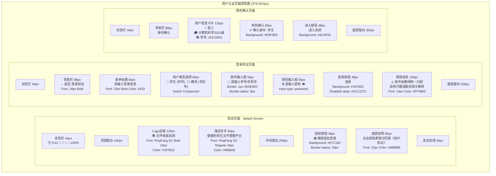
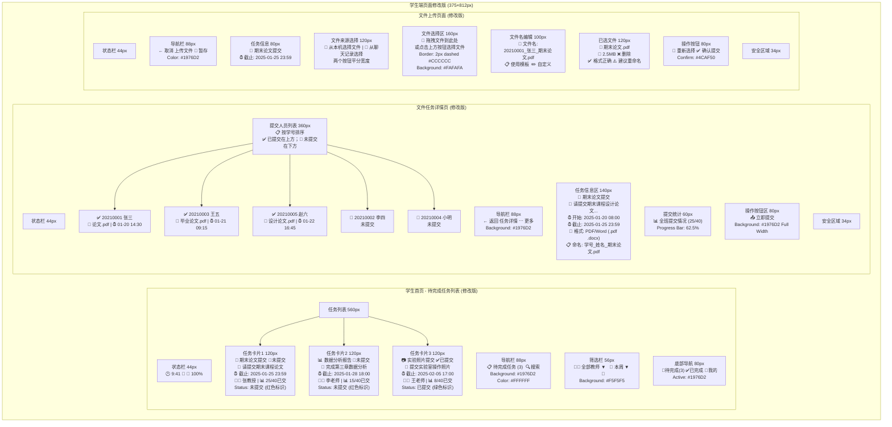
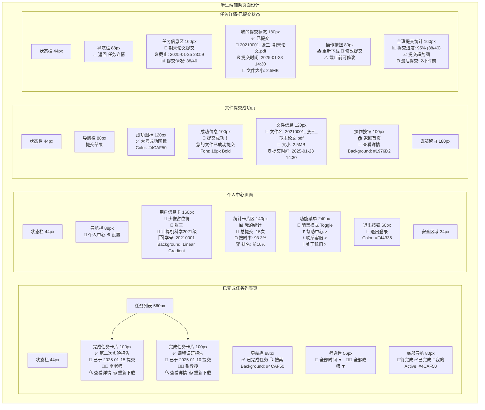
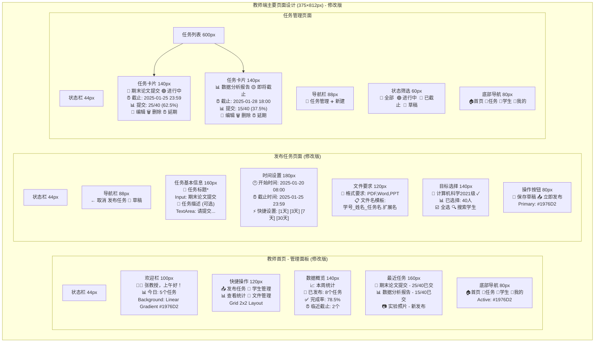
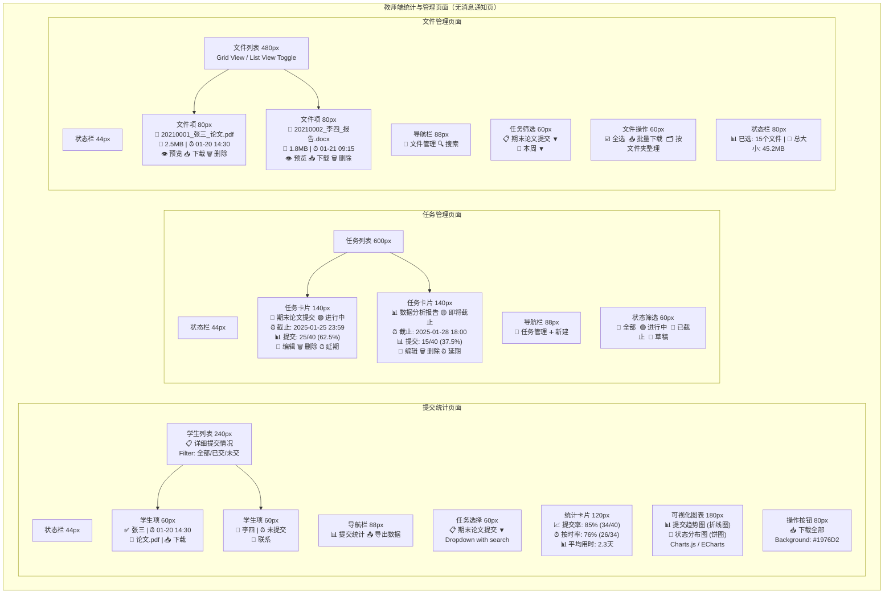

# originbook - 微信小程序文件收取系统 页面原型图

生成日期：2025-01-

## 1. 用户认证页面原型图

## 2. 学生端页面原型图（修改版）

## 2.1 学生端辅助页面设计

## 3. 教师端主要页面设计（修改版，已移除“消息通知页面”）

## 3.1 教师端统计与文件管理（已移除“消息通知页面”）

## 项目架构

### 开发要求

- 请你在我已有的架构下进行拓展开发。

### 、 已有架构

- zuoye-shoushou（项目）
  |--backend（后台）
  |--forentend（前台）

### 关于脚手架

- 后台代码的脚手架已经搭建完成，请按照脚手架规范，并按照 Test 示例进行开发
- 前台代码需要你自己生成

---
